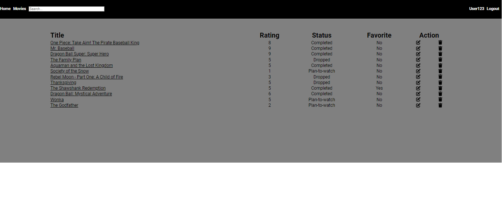

# Movie Tracker App

The Movie Tracker App is designed to help users keep track of their favorite movies, rate them, and save movies that they want to watch in a personalized list. The app uses The Movie Database (TMDb) API to fetch detailed information about movies.

## Features

- **Movie Search:** Easily search for movies using the extensive TMDb database.
- **Rating System:** Rate your movie preferences.
- **Status:** Keep track of the movies you have completed, dropped or that you plan to watch.
- **Token-Based Authentication:** Securely authenticate users with token-based authentication.

## Technologies Used

- **Frontend:** React
- **Backend:** Node.js
- **Database:** PostgreSQL
- **Authentication:** Token-based

### Home Page
The main page of the application. Presents the 10 most recent movies and the 10 highest rated movies.

### User profile Page
Contains the list of movies of the user. The "action" column allows the user to edit or delete movies from his list in this page.

### Top movie List Page
It shows the highest rated movies in descending order. It also contains pagination, 20 movies are fetched per page.

### Movie Page
Contains information about a specific movie. And contains a form so that the user can add the movie to his list. 
